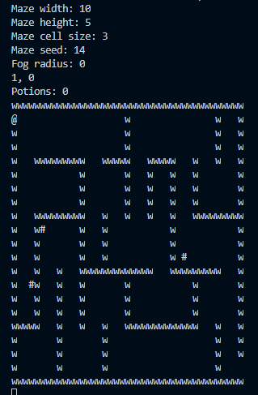
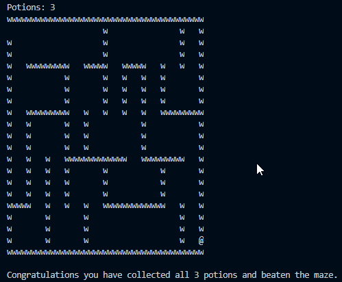

# Maze-Game
A console based maze game in C (MinGW).

•The player(@) needs 3 potions(#) to exit the maze.

•Fog feature, only renders a cube around the player.

•Wall collisoin.

•Success and failure criteria.

User enters varibles to generate the maze, note that the cell size must be uneven int (1,3,5..).

A fog radius above 0 will implement the feature when the maze generates.

3 potions have been collected and the game is finished when the player exits the maze.

